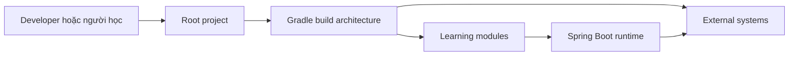
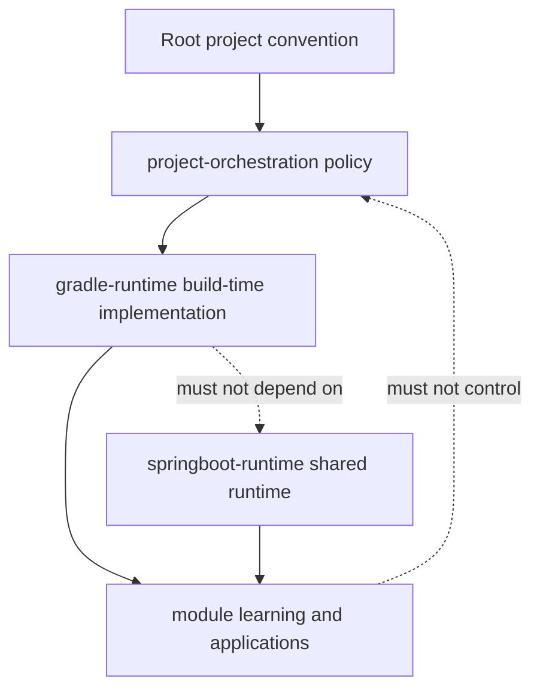
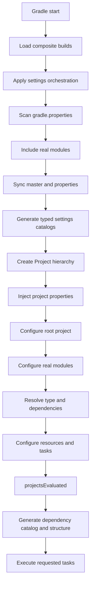

# Kiến trúc dự án Java Learning

## 1 Mục đích của tài liệu

**Status:** As Is và Target

Tài liệu này là architecture contract cấp repository cho dự án `java-learning`. Tài liệu xác định mục tiêu, ranh giới, ownership, source of truth, module contract, build flow và các invariant mà thay đổi trong dự án phải tuân thủ.

Tài liệu không thay thế README của từng module. README module giải thích kiến thức và ví dụ cụ thể; tài liệu này giải thích cách toàn bộ repository được tổ chức và vận hành như một hệ thống.

Mỗi nhận định kiến trúc quan trọng phải thuộc một trong ba trạng thái:

| Trạng thái | Ý nghĩa | Cách sử dụng |
| --- | --- | --- |
| `As Is` | Đã được implementation hiện tại chứng minh | Phải kèm source evidence khi cần |
| `Target` | Kiến trúc mục tiêu đã được đề xuất nhưng chưa chắc đã triển khai | Không được mô tả như behavior hiện tại |
| `Known Gap` | Chưa có contract hoặc chưa đủ evidence | Không tự suy đoán để lấp khoảng trống |

Khi một section chứa nhiều trạng thái, từng statement quan trọng phải được gắn nhãn riêng.

## 2 Phạm vi và ranh giới

**Status:** As Is

Architecture contract này bao phủ:

- Root Gradle project.
- Build logic trong `project-build/gradle-runtime`.
- Policy composition trong `project-orchestration`.
- Shared runtime boundary dự kiến trong `project-build/springboot-runtime`.
- Cây module học tập trong `module` ở cấp cấu trúc, metadata và dependency contract.
- Tài nguyên hỗ trợ cấp repository trong `internal`.
- Generated source, catalog và documentation do build logic tạo ra.

Architecture contract này không mặc định bao phủ package architecture bên trong từng module. Package source chỉ được khảo sát khi có yêu cầu phân tích module cụ thể.

## 3 Mục tiêu kiến trúc

**Status:** Target

Kiến trúc hướng tới các mục tiêu sau:

1. Mỗi chủ đề học tập có thể được quản lý như một module độc lập.
2. Module dùng chung một build convention nhưng vẫn giữ được cấu hình đặc thù.
3. Build-time capability và runtime capability có ownership riêng.
4. Metadata khai báo bởi người dùng không bị lẫn với artifact được sinh tự động.
5. Quá trình discovery và generation cho cùng input phải tạo cùng output.
6. Một chat hoặc một phiên phân tích module có thể nạp đủ context từ contract chuẩn mà không cần suy đoán.

## 4 Nguyên tắc kiến trúc

**Status:** Target

### 4.1 Convention tập trung

Quy tắc dùng chung thuộc root build logic. Module chỉ khai báo metadata, dependency và behavior riêng. Không sao chép cùng một convention vào nhiều `build.gradle` module.

### 4.2 Explicit over implicit

Một real module phải có dấu hiệu nhận diện rõ ràng. Feature phải được bật bằng metadata hoặc bằng một input vật lý đã quy định, chẳng hạn `docker-compose.yml`.

### 4.3 Generated projection không phải source of truth

Enum, catalog, sơ đồ và `task.gradle` được sinh từ input khác. Chúng không được dùng để đảo ngược ownership và trở thành nơi khai báo dữ liệu gốc.

### 4.4 Idempotent generation

Generator phải so sánh nội dung trước khi ghi. Cùng input phải tạo cùng output và không thay đổi timestamp khi nội dung không đổi.

### 4.5 Human owned content được bảo vệ

File do người dùng sở hữu phải được giữ lại. Generator chỉ được tạo lần đầu, đồng bộ phần schema thuộc hệ thống, hoặc ghi vào vùng generated đã xác định.

### 4.6 Build time tách khỏi runtime

Build plugin, scanner, generator và Gradle task thuộc `gradle-runtime`. Spring Boot configuration được đóng gói để ứng dụng sử dụng khi chạy thuộc `springboot-runtime`.

### 4.7 Evidence before assumption

Tài liệu phải dựa trên implementation, metadata hoặc ADR. Thiếu evidence phải được đánh dấu `Known Gap`.

## 5 Quality Attributes

**Status:** Target, một phần đã có As Is

| Thuộc tính | Contract | Evidence hiện tại |
| --- | --- | --- |
| Idempotency | Generator không ghi lại file nếu nội dung không đổi | Nhiều service dùng `writeIfChanged` hoặc so sánh nội dung |
| Determinism | Thứ tự module và generated entry phải ổn định | Module được sort theo relative path |
| Reproducibility | Build không phụ thuộc vào thao tác thủ công không được khai báo | Chưa có kiểm chứng đầy đủ, `Known Gap` |
| Maintainability | Policy được gom trong orchestration và service chuyên trách | Đã có phân lớp plugin, service và utils |
| Extensibility | Capability mới có extension point và ownership rõ | Plugin registry đã có; contract mở rộng cần chuẩn hóa thêm |
| Fail Fast | Metadata hoặc path không hợp lệ phải báo lỗi có ngữ cảnh | Nhiều service ném `GradleException` |
| Minimal File Rewrite | Chỉ ghi khi nội dung thay đổi | Đã xuất hiện trong metadata, structure, catalog và task generation |
| Boundary Safety | Build-time không phụ thuộc runtime implementation | Chưa có automated architecture test, `Known Gap` |

## 6 Source of Truth

**Status:** As Is và Target

### 6.1 Chuỗi authority

```text
Repository filesystem
        |
        v
Module identity: <module>/gradle.properties
        |
        v
Canonical metadata schema:
project-build/gradle-runtime/src/main/resources/automation/*.json
        |
        v
Synchronized module state:
<module>/master.json + <module>/properties.json
        |
        v
Injected Gradle properties
        |
        v
Generated projections:
typed enums + dependency catalog + structure documents + task.gradle
```

### 6.2 Authority matrix

| Dữ liệu | Authoritative source | Projection hoặc consumer |
| --- | --- | --- |
| Module tồn tại trong Gradle build | Module-local `gradle.properties` và filesystem | Gradle project hierarchy |
| Schema `master.json` | `gradle-runtime` resource `automation/master.json` | Module-local `master.json` |
| Schema `properties.json` | `gradle-runtime` resource `automation/properties.json` | Module-local `properties.json` |
| Giá trị cấu hình module | `VALUE` trong module-local JSON | Extra properties của Gradle project |
| Service catalog | Module metadata được scan | `ModuleListEnum` generated projection |
| Database catalog | Module metadata được scan | `DatabaseListEnum` generated projection |
| Dependency catalog | Dependency configuration của module được đánh dấu | `module-depend.json` generated projection |
| Sơ đồ module | Cây thư mục dưới `module` và metadata liên quan | `STRUCTURE.md` và `module-structure.txt` |
| Danh sách task hiển thị | Task definition resources và feature flags | Module-local `task.gradle` |

`ModuleListEnum`, `DatabaseListEnum`, `module-depend.json`, `STRUCTURE.md`, `module-structure.txt` và `task.gradle` không phải nơi chỉnh dữ liệu gốc.

## 7 System Context

**Status:** As Is

Repository phục vụ hai nhóm tương tác chính:

- Người học hoặc developer khai báo module, viết ví dụ, chạy ứng dụng và đọc README.
- Gradle build system khám phá module, đồng bộ metadata, áp dụng convention, sinh resource và thực thi task.

Các hệ thống ngoài repository có thể gồm Maven repository, Gradle Plugin Portal, database, Docker và dịch vụ dịch thuật. Chỉ capability được bật mới được phép tạo quan hệ với hệ thống ngoài tương ứng.



## 8 Repository Landscape và Component Ownership

**Status:** As Is và Target

| Component | Ownership | Status |
| --- | --- | --- |
| Root project | Phiên bản, repository, Java convention, Spring BOM và artifact destination | As Is |
| `project-build/gradle-runtime` | Build plugin, scanner, generator, task, extension, service và utility | As Is |
| `project-build/springboot-runtime` | Shared Spring Boot runtime capability | Target; thư mục hiện chưa có implementation |
| `project-orchestration` | Composition policy cho settings, root và module | As Is |
| `module` | Module học tập và module runtime cụ thể | As Is |
| `internal` | Tài nguyên hỗ trợ vận hành cấp repository | As Is; contract chi tiết là Known Gap |

### 8.1 Root Project

**Status:** As Is

Root project sở hữu version plugin, Java 21, group, version, repository, JUnit Platform, Spring Cloud BOM và vị trí output của `bootJar`. Root không sở hữu nội dung học tập của module.

### 8.2 Gradle Runtime

**Status:** As Is

`project-build/gradle-runtime` là build-time control plane. Component này cung cấp plugin implementation và các service thực hiện discovery, metadata synchronization, dependency wiring, resource generation và manual task registration.

Nó không được chứa business behavior chạy trong application sau khi build hoàn tất.

### 8.3 Spring Boot Runtime

**Status:** Target

`project-build/springboot-runtime` là nơi dự kiến chứa shared runtime capability như Swagger runtime configuration, logging configuration, security configuration, Jackson configuration và global error handling.

Thư mục hiện tồn tại nhưng chưa có implementation, vì vậy mọi capability cụ thể trong boundary này đang là `Known Gap` cho đến khi có source hoặc ADR.

### 8.4 Project Orchestration

**Status:** As Is

`project-orchestration` sở hữu thứ tự và policy áp dụng capability. Nó không nên chứa implementation chi tiết của generator. Ba entry point hiện tại là:

- `SettingsOrchestrationPlugin`.
- `RootOrchestrationPlugin`.
- `ModuleOrchestrationPlugin`.

### 8.5 Learning Modules

**Status:** As Is

`module` chứa taxonomy và real module. Module sở hữu nội dung học tập, dependency riêng, runtime configuration riêng và README riêng.

## 9 Architecture Boundaries

**Status:** Target



Boundary rules:

1. `project-orchestration` composition được phép phụ thuộc `gradle-runtime` API.
2. `gradle-runtime` không phụ thuộc source của learning module.
3. `springboot-runtime` không chứa Gradle discovery hoặc file generator.
4. Module được phép consume shared runtime capability nhưng không được điều khiển global orchestration.
5. Generated projection không được import ngược vào nơi tạo canonical input nếu làm phát sinh vòng phụ thuộc.

## 10 Phân vùng kiến thức

**Status:** As Is

Cây module hiện được chia thành bốn vùng cấp cao:

| Vùng | Vai trò |
| --- | --- |
| `infrastructure` | DevOps và system infrastructure như database, network, observability, security và server |
| `integration` | Cơ chế giao tiếp như broker, HTTP, gRPC, SSE, RSocket và WebSocket |
| `microservice` | Hệ thống mẫu gồm infrastructure service, platform capability, deployment và business service |
| `platform` | Java, Spring, build tool, pattern, paradigm, quality, testing và capability hỗ trợ |

Taxonomy là cấu trúc học tập. Taxonomy không tự động quyết định `MODULE_TYPE` hoặc dependency direction; hai yếu tố này phải được khai báo bằng module contract.

## 11 Real Module và Intermediate Project

### 11.1 Real Module

**Status:** As Is

Một thư mục được nhận diện là real module khi có `gradle.properties`. Settings scanner dùng file này để include module vào Gradle build. Root `gradle.properties` bị loại trừ và các path bên trong `build` hoặc `.gradle` không được scan.

### 11.2 Intermediate Project

**Status:** As Is

Gradle có thể tạo project trung gian để biểu diễn namespace của một module path nhiều cấp. Intermediate project không có `gradle.properties` và không được nhận module orchestration.

Invariant: Không suy luận rằng mọi Gradle subproject đều là real module.

## 12 Module Type Model

**Status:** As Is

| Module type | Source structure | Runnable | Artifact policy | Capability mặc định |
| --- | --- | --- | --- | --- |
| `APPLICATION` | Java và resources | Có | `bootJar` | Spring Web; database và Swagger theo flag |
| `LIBRARY` | Java và resources | Không | `jar` bật, `bootJar` và `bootRun` tắt | Reusable code hoặc configuration |
| `PLATFORM` | Không tự tạo physical Java structure | Không | `jar` bật, `bootJar` và `bootRun` tắt | Resource hoặc configuration composition |

Nếu `MODULE_TYPE` trống hoặc không hợp lệ, common plugin setup vẫn chạy nhưng specialized structure và type-specific configuration bị bỏ qua.

## 13 Module Contract

**Status:** As Is và Target

### 13.1 Input bắt buộc

- `gradle.properties` để xác lập module identity.
- `master.json` sau lần synchronization đầu tiên.
- `SERVICE_NAME` duy nhất khi module cần được tham chiếu ổn định.
- `MODULE_TYPE` hợp lệ khi module cần specialized behavior.

### 13.2 Input tùy chọn

- `properties.json` được sinh theo active feature group.
- `build.gradle` cho dependency hoặc cấu hình riêng.
- `docker-compose.yml` để kích hoạt Docker setup.
- README và source do người dùng sở hữu.

### 13.3 Generated output

- Cấu trúc source ban đầu cho `APPLICATION` và `LIBRARY`.
- Main class ban đầu cho `APPLICATION`.
- `task.gradle` khi `USE_TASK=TRUE`.
- YML, ENV, README hoặc Swagger resource theo feature flag và plugin tương ứng.

### 13.4 Ownership rule

Main class chỉ được tạo khi chưa tồn tại và trở thành human-owned sau lần tạo đầu. Module-local `VALUE` được giữ khi schema JSON được đồng bộ. Generator không được ghi đè nội dung học tập mà không có contract rõ ràng.

## 14 Metadata Model

**Status:** As Is

### 14.1 master json

`master.json` mô tả identity, module type và feature flag. Các key chính gồm:

- `MODULE_TYPE`.
- `SERVICE_NAME`.
- `SERVICE_NAME_DESCRIBE`.
- `IS_MODULE_DEPEND`.
- `BUILD_ENV`, `BUILD_YML`, `BUILD_README`, `BUILD_TESTER`, `BUILD_SWAGGER`.
- `BUILD_DATABASE_MODULE`, `ADD_MODULE_DEPEND`, `USE_DATABASE`, `USE_TASK`.

### 14.2 properties json

`properties.json` chứa setting chi tiết cho những group được kích hoạt trong `master.json`, gồm ENV, YML, README, Swagger, Database và Module Depend.

### 14.3 gradle properties

Module-local `gradle.properties` là marker vật lý để discovery. Root `gradle.properties` chỉ chứa Gradle behavior toàn repository như parallel execution, configure on demand và caching.

### 14.4 Property injection

Sau khi project hierarchy được load, giá trị từ `master.json` được inject trước, sau đó tới `properties.json`. Nếu hai JSON chứa cùng key, giá trị từ `properties.json` thắng trong phạm vi injection này.

## 15 Module Dependency Architecture

**Status:** As Is và Target

### 15.1 Conceptual model

| Consumer | Dependency được phép theo target contract |
| --- | --- |
| Application | Library, shared runtime capability và platform resource phù hợp |
| Library | Library có abstraction thấp hơn hoặc cùng layer được cho phép |
| Platform | Resource hoặc platform composition không tạo runtime cycle |
| Build runtime | Gradle API và build tooling, không phụ thuộc learning application |

### 15.2 Resolution hiện tại

**Status:** As Is

`MODULE_DEPEND_LIST` chứa danh sách `SERVICE_NAME`. Build logic resolve từng service thành Gradle project và thêm `implementation project(...)`. `annotationProcessor` external dependency của source module có thể được propagate sang consumer.

Khi `USE_DATABASE=TRUE`, `DATABASE_LIST` được resolve thành database module dependency. Application cũng nhận validation dependency trong flow này.

Khi `BUILD_SWAGGER=TRUE`, application hiện tìm module có service name `GLOBAL_SWAGGER_CONFIG` và thêm làm implementation dependency.

### 15.3 Dependency invariants

**Status:** Target

1. `SERVICE_NAME` phải duy nhất trong toàn repository.
2. Dependency graph không được có cycle.
3. Library không phụ thuộc Application.
4. Build-time component không phụ thuộc runtime module.
5. Generated catalog không được dùng làm canonical metadata input.
6. Dependency bắt buộc dùng chung phải được quản lý ở root hoặc capability owner, không sao chép tùy ý.
7. Vi phạm direction phải fail build khi automated validation được triển khai.

Automated cycle detection và enforcement hiện chưa được chứng minh bởi source đã khảo sát, nên là `Known Gap`.

## 16 Gradle Composite Build

**Status:** As Is

Root `settings.gradle` dùng `includeBuild` để nạp `project-build/gradle-runtime` và `project-orchestration`. `project-orchestration` cũng khai báo dependency tới `gradle-runtime`. Cách tổ chức này cho phép settings plugin có classpath ngay trong initialization phase mà không phụ thuộc `buildSrc` của root.

`gradle-runtime` đăng ký plugin từ `project-plugin-list.json`. Registry tạo mapping giữa plugin name, plugin ID và implementation class.

## 17 Orchestration Architecture

### 17.1 Settings Orchestration

**Status:** As Is

Purpose: sở hữu các quyết định phải hoàn tất trước khi Gradle cấu hình Project instance.

Inputs:

- Repository filesystem.
- Module-local `gradle.properties`.
- Canonical metadata schemas.

Outputs:

- Included Gradle projects.
- Synchronized module metadata.
- Generated module và database catalogs dạng typed source.
- Extra properties được inject vào project.

Invariant: Settings orchestration không phụ thuộc vào dependency configuration chỉ tồn tại sau khi project evaluation hoàn tất.

### 17.2 Root Orchestration

**Status:** As Is

Root orchestration chỉ được áp dụng cho root project. Nó compose catalog setup, structure setup, database task support và cleanup task support.

Dependency catalog và project structure được tạo sau `projectsEvaluated`, khi module đã khai báo dependency và metadata cần thiết.

### 17.3 Module Orchestration

**Status:** As Is

Module orchestration thực hiện:

1. Bỏ qua intermediate project.
2. Resolve `SERVICE_NAME` để logging.
3. Apply dependency setup.
4. Apply common module configuration và module type behavior.
5. Apply YML setup cho mọi real module.
6. Apply ENV, README, Swagger và task setup theo feature flag.
7. Apply Docker setup nếu có `docker-compose.yml`.

Orchestration quyết định capability nào được áp dụng; service bên dưới sở hữu implementation chi tiết.

## 18 Plugin Service và Utility Architecture

**Status:** As Is

### 18.1 Plugin

Plugin là entry point tích hợp với Gradle lifecycle. Plugin kiểm tra scope, đọc condition và gọi service. Plugin không nên chứa toàn bộ thuật toán generation.

### 18.2 Service

Service thực hiện một responsibility cụ thể như scan, synchronization, structure generation, dependency resolution hoặc resource configuration.

### 18.3 Utility

Utility cung cấp thao tác dùng chung cho Gradle project, property, plugin và dependency. Utility không được giữ mutable global state làm kết quả build phụ thuộc thứ tự ngẫu nhiên.

### 18.4 Task

Task chứa hành động chỉ chạy trong execution phase. Hành động destructive hoặc external side effect phải nằm trong task action và không được chạy khi chỉ load project.

### 18.5 Extension

Extension cung cấp typed configuration surface cho task. Extension field phải có default rõ ràng và được validate trước khi task thực thi.

## 19 Build Lifecycle và các flow chính

**Status:** As Is



### 19.1 Module discovery flow

Scanner đi qua repository, tìm `gradle.properties`, loại root file và path bị exclude, chuẩn hóa relative path rồi sort kết quả. Mỗi kết quả được include với Gradle project path tương ứng.

### 19.2 Metadata synchronization flow

Canonical schema được load một lần. Module-local JSON được parse; `VALUE` hiện có được giữ, còn description, type, group và metadata schema được lấy từ canonical template. `properties.json` chỉ giữ các group đang active.

### 19.3 Module configuration flow

Mọi real module nhận common plugin gồm `java-library`, Spring Boot, dependency management và Lombok. Specialized structure và task behavior phụ thuộc `MODULE_TYPE` và feature flag.

### 19.4 Resource generation flow

YML resource policy áp dụng cho mọi real module; initialization phụ thuộc `BUILD_YML`. ENV, README và Swagger structure phụ thuộc flag tương ứng. `task.gradle` được tạo trong configuration phase khi `USE_TASK=TRUE`.

### 19.5 Build test package flow

Root thiết lập Java 21 và JUnit Platform cho project có Java plugin. Application tạo `bootJar` vào `root/build/jar/<project-path>`. Library và Platform tắt `bootJar`, bật plain `jar` và tắt `bootRun`.

## 20 Build Time và Runtime

**Status:** As Is và Target

### 20.1 Tại sao phải tách

Build-time code chạy trong Gradle process và có quyền scan hoặc tạo file. Runtime code chạy trong Spring application và phục vụ request hoặc application lifecycle. Trộn hai loại code làm dependency graph khó kiểm soát và khiến ứng dụng mang theo build tooling không cần thiết.

### 20.2 Interaction contract

Build-time được phép tạo artifact và metadata mà runtime consume. Runtime không được gọi ngược Gradle plugin hoặc generator. Giao tiếp giữa hai phía phải qua artifact, resource hoặc dependency đã khai báo.

### 20.3 Shared Runtime Capability Contract

**Status:** Target

Mỗi capability mới trong `springboot-runtime` phải xác định:

- Purpose và consumer.
- Public configuration surface.
- Auto-configuration hoặc explicit enable mechanism.
- Runtime dependencies.
- Default behavior và opt-out behavior.
- Compatibility với Spring Boot version.
- Test strategy.
- Ownership và versioning.

Capability không được thực hiện filesystem discovery hoặc ghi source trong Gradle configuration phase.

## 21 Cross Cutting Architecture

### 21.1 Configuration Management

**Status:** As Is và Target

Hiện project dùng module metadata, profiles `dev`, `loc`, `prd`, YML composition và ENV generation. Target contract yêu cầu secret không được commit vào generated configuration và precedence phải được mô tả cho từng capability.

### 21.2 Dependency Management

**Status:** As Is

Root quản lý Spring Boot plugin, dependency management plugin và Spring Cloud BOM. Module thêm dependency đặc thù. Internal module dependency được resolve theo `SERVICE_NAME`.

### 21.3 Secrets Management

**Status:** As Is và Known Gap

Build runtime có abstraction `SecretProvider` với environment và Windows DPAPI provider. Repository có PowerShell script để set, list và remove secret. Contract rotation, masking log và CI provider chưa được xác lập đầy đủ.

### 21.4 Database Management

**Status:** As Is

Root đăng ký manual task cho database backup và MongoDB whitelist. Database module discovery dựa trên metadata generated catalog. Task có side effect chỉ được chạy khi người dùng gọi rõ ràng.

### 21.5 API và Swagger

**Status:** As Is và Target

Hiện Swagger gồm build-time resource generation và một module runtime được resolve bằng service name. Target architecture chuyển shared Swagger runtime configuration về `springboot-runtime`; generator vẫn thuộc `gradle-runtime`.

### 21.6 Testing Architecture

**Status:** Known Gap

Root đã chuẩn hóa JUnit Platform và metadata có `BUILD_TESTER`, nhưng chưa có architecture contract đầy đủ cho unit, integration và end-to-end test ở cấp module.

### 21.7 Logging và Observability

**Status:** Known Gap

Repository đã có taxonomy cho logging, metrics, tracing và diagnostic. Shared runtime contract cho correlation, structured logging, metric naming và trace propagation chưa được chứng minh.

### 21.8 Security Architecture

**Status:** Known Gap

Repository đã có taxonomy cho IAM, Vault và Spring Security. Authentication, authorization, secret boundary và secure defaults cần ADR hoặc implementation cụ thể trước khi trở thành `As Is`.

### 21.9 Documentation Automation

**Status:** As Is

Build runtime có capability tạo README menu, final README, translation và project structure. Generated documentation phải dẫn về canonical metadata và không được trở thành input ngược.

## 22 Learning Architecture

**Status:** Target

### 22.1 Learning Module Template

Mỗi module hoàn chỉnh nên có:

1. Mục tiêu học tập.
2. Kiến thức nền cần có.
3. Khái niệm từ cơ bản đến nâng cao.
4. Giải thích source hoặc configuration.
5. Ví dụ chạy được.
6. Bài thực hành.
7. Câu hỏi tự kiểm tra.
8. Bài tập mở rộng.
9. Liên kết tới module prerequisite và follow-up.

### 22.2 Learning progression

Learning path phải dựa trên prerequisite rõ ràng, không chỉ dựa vào vị trí thư mục. Một module nâng cao phải link tới kiến thức nền liên quan.

### 22.3 README Contract

README module là entry point của nội dung học tập. README phải giải thích mục tiêu, cách chạy, cấu trúc ví dụ, kết quả mong đợi và giới hạn. README không sao chép toàn bộ architecture contract cấp repository.

### 22.4 Module completion criteria

Một module chỉ được coi là hoàn chỉnh khi metadata hợp lệ, build phù hợp với type, README đủ learning workflow, ví dụ có thể kiểm chứng và dependency không vi phạm invariant.

## 23 Architecture Invariants

**Status:** Target

Các invariant sau phải được tuân thủ trừ khi có ADR thay đổi:

1. Real module được nhận diện bằng module-local `gradle.properties`.
2. Intermediate project không nhận module orchestration.
3. Canonical JSON schema thuộc `gradle-runtime`.
4. Module-local `VALUE` thuộc người dùng và được giữ khi synchronize.
5. Generated projection không phải authoritative input.
6. `SERVICE_NAME` dùng làm định danh tham chiếu phải duy nhất.
7. Dependency graph không có cycle.
8. Library không phụ thuộc Application.
9. Build runtime không phụ thuộc learning application hoặc shared runtime implementation.
10. Runtime capability không chứa Gradle file-generation behavior.
11. Generator phải deterministic và idempotent.
12. Human-owned source không bị overwrite sau lần tạo đầu.
13. External side effect chỉ chạy trong task được gọi rõ ràng.
14. Architecture statement thiếu evidence phải ghi `Target` hoặc `Known Gap`.
15. Thay đổi invariant phải có ADR.

## 24 Acceptance Checklists

### 24.1 Module Acceptance Checklist

- Có module-local `gradle.properties`.
- `MODULE_TYPE` hợp lệ.
- `SERVICE_NAME` hợp lệ và không trùng.
- Feature flag và properties group nhất quán.
- Dependency direction hợp lệ và không có cycle.
- Generated file không được sửa làm source of truth.
- README đáp ứng learning contract.
- Build và test phù hợp với module type.

### 24.2 Build Capability Acceptance Checklist

- Capability thuộc `gradle-runtime`.
- Xác định Root, Settings hay Module scope.
- Plugin chỉ compose lifecycle; service sở hữu implementation.
- Input, output và file ownership rõ ràng.
- Generation deterministic và idempotent.
- Không tạo side effect ngoài execution task nếu không có lý do kiến trúc được ghi nhận.
- Có validation và error message đủ ngữ cảnh.
- Được nối vào orchestration tại đúng phase.

### 24.3 Shared Runtime Capability Acceptance Checklist

- Capability thuộc `springboot-runtime`.
- Không phụ thuộc Gradle API hoặc build generator.
- Public configuration surface rõ ràng.
- Default an toàn và có opt-out khi cần.
- Có test cho activation, behavior và compatibility.
- Có hướng dẫn consumption cho application module.
- Có versioning và deprecation policy.

## 25 Change Processes

### 25.1 Thêm module mới

1. Chọn taxonomy path và module type.
2. Tạo module identity bằng `gradle.properties`.
3. Chạy synchronization được phê duyệt để tạo metadata.
4. Khai báo service name, feature và dependency.
5. Kiểm tra generated projections.
6. Hoàn thiện README và ví dụ.
7. Chạy acceptance checklist.

### 25.2 Thêm Build Capability

1. Xác định lifecycle phase và scope.
2. Định nghĩa plugin entry point.
3. Đặt implementation trong service hoặc task phù hợp.
4. Đăng ký plugin trong registry.
5. Compose vào orchestration.
6. Chứng minh idempotency và ownership.
7. Viết ADR nếu capability thay đổi invariant.

### 25.3 Thêm Shared Runtime Capability

1. Xác định runtime use case và consumer.
2. Thiết kế public contract.
3. Implement trong `springboot-runtime`.
4. Khai báo dependency và activation mechanism.
5. Kiểm tra compatibility.
6. Cập nhật consumption guide.
7. Chạy acceptance checklist.

### 25.4 Thay đổi canonical schema

Schema change phải xác định migration behavior, default, preservation của module-local `VALUE`, backward compatibility và ảnh hưởng tới generated projection.

## 26 Architecture Decision Records

**Status:** Target

ADR bắt buộc khi thay đổi:

- Architecture boundary hoặc ownership.
- Source of truth.
- Module type semantics.
- Dependency direction.
- Canonical metadata schema theo cách không tương thích.
- Build-time và runtime separation.
- Architecture invariant.

Mỗi ADR tối thiểu có context, decision, alternatives, consequences, migration và status.

## 27 Legacy và Technical Debt

### 27.1 project setup

**Status:** As Is Legacy

Convention mục tiêu không còn coi `project-build/gradle-rumtime` là component architecture độc lập. Tuy nhiên implementation hiện tại vẫn ghi các artifact sau vào path này:

- `ModuleListEnum.groovy`.
- `DatabaseListEnum.groovy`.
- `module-depend.json`.
- `module-structure.txt`.

Do đó chưa được xóa path hoặc mô tả migration là hoàn tất. Target là chuyển ownership của generated artifacts về `project-build` hoặc một generated output boundary được ADR xác định, sau đó loại bỏ reference cũ.

### 27.2 Shared runtime chưa được triển khai

**Status:** Known Gap

`project-build/springboot-runtime` hiện là boundary rỗng. Swagger, logging, security, Jackson và error-handling runtime capability chưa có contract được implementation chứng minh.

### 27.3 Architecture enforcement

**Status:** Known Gap

Các rule về unique service name, dependency cycle, forbidden direction và build-time/runtime boundary chưa có automated validation đầy đủ được xác nhận trong phạm vi khảo sát.

### 27.4 Testing contract

**Status:** Known Gap

JUnit Platform đã được cấu hình nhưng test pyramid, source set, integration environment và coverage expectation chưa được chuẩn hóa ở cấp repository.

## 28 Architecture Roadmap

**Status:** Target

### Giai đoạn 1 Chuẩn hóa contract

- Chốt source of truth và ownership.
- Chốt module type và dependency invariants.
- Tạo ADR convention.
- Xác định migration khỏi `project-build`.

### Giai đoạn 2 Tách shared runtime

- Thiết lập build cho `springboot-runtime`.
- Di chuyển shared Swagger runtime capability.
- Chuẩn hóa logging, Jackson và error handling theo ADR.

### Giai đoạn 3 Tự động kiểm tra kiến trúc

- Validate unique `SERVICE_NAME`.
- Detect dependency cycle.
- Enforce allowed direction.
- Validate generated artifact ownership.
- Kiểm tra metadata schema và compatibility.

### Giai đoạn 4 Hoàn thiện learning architecture

- Chuẩn hóa README template.
- Xây learning path và prerequisite graph.
- Áp dụng module completion checklist.
- Theo dõi knowledge gap.

## 29 AI và Developer Context Contract

**Status:** Target

Khi làm việc với repository, đọc theo thứ tự:

1. `AGENTS.md`.
2. `ARCHITECTURE.md`.
3. Root `settings.gradle` và `build.gradle`.
4. Tài liệu architecture chuyên sâu liên quan nếu tồn tại.

Khi phân tích một module cụ thể, nạp thêm:

- Module path.
- `SERVICE_NAME`.
- `MODULE_TYPE`.
- Module-local `gradle.properties`.
- `master.json`.
- `properties.json`.
- `build.gradle`.
- Direct dependencies.
- README.
- Runtime configuration liên quan.
- Source tree khi người dùng cho phép đọc source package.

Không chỉnh sửa file khi chỉ được yêu cầu phân tích. Quyết định mới không được vi phạm Architecture Invariants nếu chưa có ADR thay đổi chúng.

## 30 Tài liệu chuyên sâu dự kiến

**Status:** Target

Tài liệu trung tâm này có thể được mở rộng bằng các tài liệu sau mà không lặp lại contract:

```text
docs/architecture/
├── README.md
├── gradle.md
├── modules.md
├── runtime.md
├── configuration.md
├── dependencies.md
├── learning.md
├── governance.md
├── legacy.md
└── adr/
    ├── README.md
    └── ADR-template.md
```

`ARCHITECTURE.md` giữ principles, boundaries, contracts, flow chính và invariant. Tài liệu chuyên sâu chứa implementation detail, inventory và hướng dẫn vận hành của từng concern.

## 31 Source Evidence

**Status:** As Is

Các file cấp root và build infrastructure đã được dùng làm evidence cho phiên bản tài liệu này:

- `settings.gradle`.
- `build.gradle`.
- `gradle.properties`.
- `project-orchestration/settings.gradle`.
- `project-orchestration/build.gradle`.
- Ba orchestration plugin trong `project-orchestration`.
- Plugin, service, utility và resource liên quan trong `project-build/gradle-runtime`.
- Canonical schema `automation/master.json` và `automation/properties.json`.
- Plugin registry và task definition resources.
- Generated structure resource và `STRUCTURE.md`.

Source package bên trong `module` không được đọc để soạn tài liệu này. Vì vậy mọi nhận định về package architecture, business behavior hoặc mức độ hoàn chỉnh của module cụ thể nằm ngoài phạm vi evidence.
