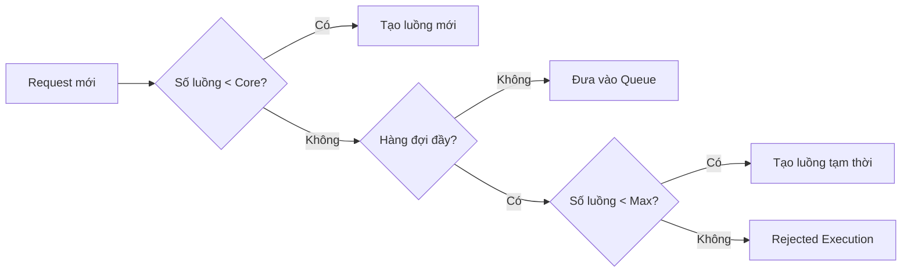

* [1.Basic](readme/vi/menu/1.Basic.md)

```mermaid
    graph LR
        A[Request mới] --> B{Số luồng < Core?}
        B -- Có --> C[Tạo luồng mới]
        B -- Không --> D{Hàng đợi đầy?}
        D -- Không --> E[Đưa vào Queue]
        D -- Có --> F{Số luồng < Max?}
        F -- Có --> G[Tạo luồng tạm thời]
        F -- Không --> H[Rejected Execution]
        
        click G "readme/vi/menu/1.Basic.md" "Basic.md"
```