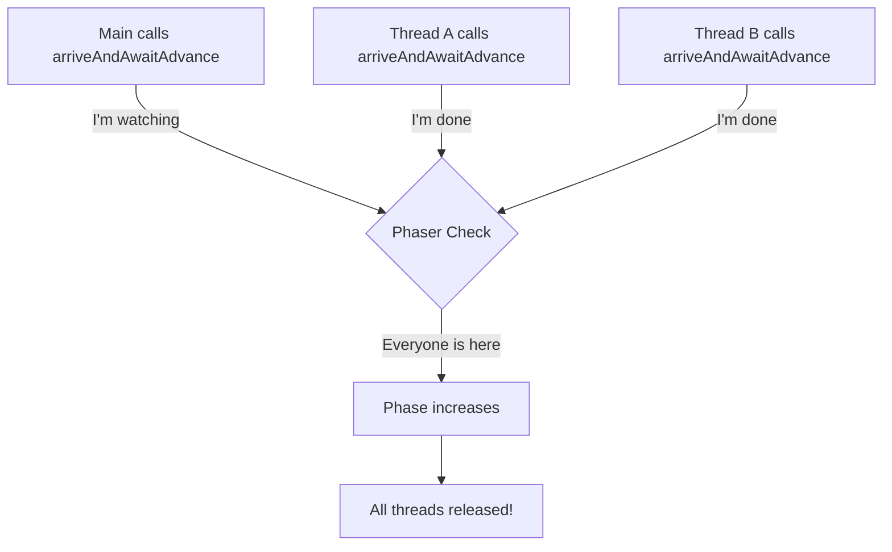

<a id="back-to-top"></a>

# Synchronizer : Bộ điều phối của Thread

## Menu
- [Synchronizers: Những thiết bị điều tiết giao thông trong Đa luồng](#synchronizers)
- [The Big Four Synchronizers: Bộ tứ điều phối siêu đẳng](#four-synchronizers)
- [Cơ chế Timeout trong CountDownLatch](#count-down-latch-timeout)
- [CyclicBarrier: Rào chắn vòng lặp và Cơ chế phối hợp nhóm](#cyclic-barrier)
- [Timeout trong CyclicBarrier: Cơ chế "Vỡ trận" (Broken Barrier)](#cyclic-barrier-timeout)
- [Semaphore: Quản lý tài nguyên dựa trên Giấy phép (Permits)](#semaphore)
- [Semaphore Nâng cao: Kỹ thuật Kiểm soát và Các cạm bẫy](#semaphore-advance)
- [Phaser: Bộ phối hợp đa giai đoạn (Multi-phase Barrier)](#phaser)
- [Cơ chế hoạt động arriveAndAwaitAdvance() của Phaser trong Java Concurrency](#arrivce-and-await-advance)


## <a id="synchronizers">Synchronizers: Những thiết bị điều tiết giao thông trong Đa luồng</a>
<details>
<summary>Click for details</summary>


Trong lập trình đa luồng, **Synchronizers** là tên gọi chung cho một nhóm các lớp (classes) nằm trong gói `java.util.concurrent`. Chúng không chỉ là những từ khóa đơn giản, mà là những công cụ (tools) mạnh mẽ để điều khiển nhịp điệu (**Flow**) của các luồng trên chip đa nhân i7.

---

### 1. Synchronized/Lock vs. Synchronizers

Để dễ hình dung, hãy so sánh chúng qua hình ảnh thực tế:
* **Synchronized/Lock (Khóa cửa):** Chỉ quan tâm đến việc *"Ai được vào, ai phải đứng ngoài"* để bảo vệ đồ đạc (dữ liệu) bên trong.
* **Synchronizers (Thiết bị giao thông):** Giống như Đèn xanh đèn đỏ, Rào chắn, Cổng xoay. Chúng điều khiển các luồng phải đợi nhau, phối hợp với nhau hoặc đi theo nhóm.

---

### 2. Tại sao gọi là Synchronizers?

Chúng đóng vai trò là **điểm đồng bộ hóa trạng thái**. Một luồng sẽ nhìn vào "trạng thái nội bộ" của bộ Synchronizer này để quyết định: *"Tôi được đi tiếp hay phải dừng lại đợi đồng đội?"*.

**4 Đặc trưng cốt lõi:**
1.  **Điểm tập kết (Point of synchronization):** Tạo ra nơi mà các luồng gặp nhau.
2.  **Quản lý trạng thái (State management):** Mỗi bộ có một biến trạng thái (ví dụ: số đếm lùi, số giấy phép).
3.  **Cơ chế chặn (Blocking):** Khả năng bắt luồng phải "ngủ" cho đến khi trạng thái thỏa mãn.
4.  **Tính đóng gói cao:** Bạn không cần viết `wait`/`notify` thủ công. Mọi logic phức tạp đã nằm trong `await()`, `acquire()`, `arrive()`.

---

### 3. Phân loại "Giao thông" (Sắp xếp vào package `coordination.synchronizers`)

| Loại Synchronizer | Hình ảnh ẩn dụ | Cách hoạt động |
| :--- | :--- | :--- |
| **CountDownLatch** | **Rào chắn một chiều** | Đợi cho đến khi $N$ sự kiện xảy ra thì mở rào. Mở xong là không đóng lại nữa. |
| **CyclicBarrier** | **Điểm hẹn nhóm** | Các luồng phải đợi đủ quân số mới được cùng vượt rào. Vượt xong rào đóng lại cho nhóm sau. |
| **Semaphore** | **Van điều tiết** | Chỉ cho phép tối đa $N$ luồng truy cập tài nguyên cùng lúc. |
| **Phaser** | **Lịch trình theo giai đoạn** | Điều phối luồng qua từng bước một (Phase 1 $\rightarrow$ Phase 2 $\rightarrow$ Phase 3). |

---

### 4. Khi nào dùng Lock, khi nào dùng Synchronizers?

* **Dùng Lock/Synchronized:** Khi bạn muốn bảo vệ tính nhất quán của dữ liệu (ví dụ: `count++`, `list.add()`).
* **Dùng Synchronizers:** Khi bạn muốn điều khiển **thứ tự và sự phối hợp** (ví dụ: Luồng A chờ luồng B, 5 luồng cùng xuất phát, giới hạn 10 kết nối Database).

---


</details>

- [Quay lại đầu trang](#back-to-top)
---
## <a id="four-synchronizers">The Big Four Synchronizers: Bộ tứ điều phối siêu đẳng</a>
<details>
<summary>Click for details</summary>


Trong hệ sinh thái Java Concurrency, **Synchronizers** là những bộ điều phối cấp cao giúp giải quyết các bài toán phối hợp nhóm phức tạp mà những cơ chế cơ bản như `wait/notify` khó lòng xử lý gọn gàng. Dưới đây là bức tranh toàn cảnh về vai trò của từng công cụ:

---

### 1. CountDownLatch (Chốt đếm lùi) - "Một cho tất cả"
Hãy tưởng tượng một **giải đua xe**: Các xe đã sẵn sàng, nhưng tất cả phải đợi trọng tài phất cờ (hoàn thành các thủ tục kiểm tra) thì mới được phép xuất phát.

* **Vai trò:** Cho phép một hoặc nhiều luồng dừng lại đợi cho đến khi một nhóm luồng khác hoàn thành xong một số lượng công việc nhất định.
* **Đặc điểm:** * Đếm lùi từ $N$ về $0$.
    * **Dùng một lần:** Khi bộ đếm đã về $0$, rào chắn mở ra vĩnh viễn và không thể tái sử dụng (Reset).
* **Ứng dụng:** Luồng chính (Main thread) đợi các dịch vụ nền (Database, Cache, Messaging) khởi tạo xong xuôi thì mới chính thức mở cổng Server.

---

### 2. CyclicBarrier (Rào chắn vòng lặp) - "Tất cả cho một"
Hãy tưởng tượng một **nhóm bạn hẹn nhau đi ăn**: Quy định là người nào đến sớm phải đợi ở cổng, khi nào đủ cả nhóm thì mới cùng nhau vào bàn tiệc.

* **Vai trò:** Các luồng phải đợi nhau tại một điểm hẹn (Barrier). Chỉ khi số lượng luồng đến điểm hẹn đủ mức quy định, rào chắn mới mở ra cho tất cả cùng đi tiếp.
* **Đặc điểm:** * **Tái sử dụng (Cyclic):** Sau khi các luồng vượt qua, nó tự động reset để dùng cho lượt tiếp theo.
    * Có thể gán một **Barrier Action** (hành động thực thi ngay khi đủ quân số).
* **Ứng dụng:** Chia một file dữ liệu lớn thành nhiều phần để tính toán song song, sau khi tất cả các luồng con hoàn thành thì mới tiến hành tổng hợp kết quả cuối cùng.

---

### 3. Semaphore (Giấy phép giới hạn) - "Bãi giữ xe"
Hãy tưởng tượng một **bãi giữ xe có giới hạn chỗ trống**: Nếu bãi đã đầy, xe tiếp theo đến phải đợi cho đến khi có một xe khác đi ra để lấy chỗ.

* **Vai trò:** Quản lý một số lượng giấy phép (**Permits**) nhất định. Kiểm soát số lượng luồng được truy cập vào một tài nguyên dùng chung tại cùng một thời điểm.
* **Đặc điểm:** * Luồng gọi `acquire()` để lấy giấy phép (nếu hết sẽ bị chặn).
    * Luồng gọi `release()` để trả lại giấy phép sau khi xong việc.
* **Ứng dụng:** Giới hạn số lượng kết nối tối đa đến Database hoặc giới hạn số lượng request xử lý đồng thời để tránh làm quá tải hệ thống.

---

### 4. Phaser (Bộ phối hợp đa giai đoạn) - "Tiến hóa cấp cao"
Đây là bộ điều phối linh hoạt nhất, kết hợp ưu điểm của cả `CountDownLatch` và `CyclicBarrier`.

* **Vai trò:** Phối hợp các luồng qua từng giai đoạn (**Phase**) của một quy trình phức tạp.
* **Đặc điểm:** * **Linh hoạt:** Số lượng luồng tham gia có thể thay đổi (đăng ký thêm hoặc hủy đăng ký) ngay trong lúc đang thực thi.
    * **Đa giai đoạn:** Hỗ trợ quy trình nhiều bước (Xong Phase 1 mới đồng loạt sang Phase 2).
* **Ứng dụng:** Quy trình xử lý dữ liệu qua nhiều bước lọc: Lọc nhiễu $\rightarrow$ Chuẩn hóa $\rightarrow$ Lưu trữ. Các luồng phải đồng bộ sau mỗi bước.

---

### Bảng so sánh nhanh

| Công cụ | Điểm mấu chốt | Tái sử dụng? |
| :--- | :--- | :--- |
| **CountDownLatch** | Một luồng đợi nhiều luồng khác hoàn thành. | **Không** |
| **CyclicBarrier** | Các luồng trong nhóm phải đợi lẫn nhau. | **Có** |
| **Semaphore** | Giới hạn số lượng luồng truy cập tài nguyên. | **Có** |
| **Phaser** | Phối hợp theo từng giai đoạn với số luồng linh hoạt. | **Có** |

---


</details>

- [Quay lại đầu trang](#back-to-top)
---
## <a id="count-down-latch-timeout">Cơ chế Timeout trong CountDownLatch</a>
<details>
<summary>Click for details</summary>


Khi sử dụng `CountDownLatch`, một rủi ro lớn là luồng chính có thể bị treo vĩnh viễn nếu một luồng phụ gặp sự cố và không bao giờ gọi `countDown()`. Để giải quyết vấn đề này, Java cung cấp cơ chế **await với thời gian chờ**.

---

### 1. Cơ chế trả về của await(timeout, unit)

Hàm `latch.await(long timeout, TimeUnit unit)` không ném ra ngoại lệ khi hết giờ. Thay vào đó, nó "buông tay" và trả về một giá trị **boolean** để bạn quyết định logic tiếp theo:

* **`true`**: Nếu con số đếm (count) về 0 trong khoảng thời gian chờ (**Thành công**).
* **`false`**: Nếu thời gian chờ đã hết mà con số đếm vẫn lớn hơn 0 (**Thất bại/Timeout**).

---

### 2. Ví dụ Code xử lý Timeout

Giả sử bạn đợi các dịch vụ khởi động, nhưng nếu quá 2 giây mà chưa xong, bạn sẽ hủy quy trình khởi động hệ thống để bảo vệ tài nguyên.

**Java**

```java
	import java.util.concurrent.CountDownLatch;
	import java.util.concurrent.TimeUnit;

	public class LatchTimeoutDemo {
	    public static void main(String[] args) throws InterruptedException {
	        CountDownLatch latch = new CountDownLatch(1);

	        // Giả lập luồng làm việc cực lâu (5 giây)
	        new Thread(() -> {
	            try {
	                Thread.sleep(5000); 
	                latch.countDown();
	            } catch (InterruptedException e) {
	                Thread.currentThread().interrupt();
	            }
	        }).start();

	        System.out.println("[Main] Tôi chỉ đợi tối đa 2 giây thôi...");

	        // Đợi trong 2 giây
	        boolean completed = latch.await(2, TimeUnit.SECONDS);

	        if (completed) {
	            System.out.println("[Main] Tuyệt vời! Mọi thứ đã xong.");
	        } else {
	            // Vượt quá thời gian, logic chạy vào đây
	            System.err.println("[Main] QUÁ GIỜ! Tôi không đợi nữa, hủy khởi động hệ thống.");
	            // LƯU Ý: Luồng phụ ở trên vẫn đang chạy ngầm, Latch không tự hủy nó.
	        }

	        System.out.println("[Main] Kết thúc hàm main.");
	    }
	}
```

---

### 3. Điều gì xảy ra với các luồng đang chạy? (Quan trọng)

Bạn cần phân biệt rõ giữa việc **"Luồng chính ngừng đợi"** và **"Các luồng phụ ngừng làm việc"**:

* **Luồng chính:** Sẽ được tiếp tục thực thi ngay lập tức sau khi hết timeout.
* **Các luồng phụ (Worker threads):** Vẫn tiếp tục chạy bình thường. `CountDownLatch` **không** tự động gửi tín hiệu ngắt (`interrupt`) tới các luồng đang làm nhiệm vụ.
* **Giá trị Count:** Vẫn tồn tại. Nếu sau đó các luồng phụ xong việc và gọi `countDown()`, giá trị vẫn giảm dần về 0, nhưng lúc này luồng chính đã đi tiếp và không còn quan tâm nữa.

---

### 4. Lời khuyên thiết kế hệ thống

Nếu bạn sử dụng timeout, hãy luôn đi kèm với logic **dọn dẹp (Cleanup)**:
1.  **Hủy luồng phụ:** Nên có cơ chế để ngắt các luồng phụ nếu chúng không còn cần thiết (ví dụ: dùng `future.cancel()` hoặc `thread.interrupt()`).
2.  **Tránh "Tiến trình rác":** Nếu không dọn dẹp, các luồng phụ này sẽ tiếp tục chiếm dụng tài nguyên RAM và CPU một cách vô ích.


</details>

- [Quay lại đầu trang](#back-to-top)
---
## <a id="cyclic-barrier">CyclicBarrier: Rào chắn vòng lặp và Cơ chế phối hợp nhóm</a>
<details>
<summary>Click for details</summary>


**CyclicBarrier** là một bộ đồng bộ hóa cho phép một tập hợp các luồng cùng chờ đợi lẫn nhau tại một "điểm hẹn" xác định trước khi tiếp tục thực thi. Khác với `CountDownLatch` vốn tập trung vào việc đếm các sự kiện, `CyclicBarrier` tập trung vào sự phối hợp giữa các thực thể luồng.

---

### 1. Những đặc tính "độc bản"

#### A. Tính xoay vòng (Cyclic)
Đây là đặc tính làm nên tên gọi của nó. Sau khi nhóm luồng đầu tiên hội quân đủ số lượng và vượt qua rào chắn, `CyclicBarrier` sẽ **tự động reset** về trạng thái ban đầu.
* **Ý nghĩa:** Bạn có thể dùng một đối tượng Barrier duy nhất cho nhiều đợt xử lý (ví dụ: xử lý dữ liệu theo từng lô/batch) mà không cần khởi tạo lại.

#### B. Barrier Action (Hành động tại rào chắn)
Bạn có thể truyền một đoạn mã (Runnable/Lambda) vào constructor của `CyclicBarrier`.
* **Cơ chế:** Đoạn code này sẽ được thực thi bởi **luồng cuối cùng** chạm tới Barrier.
* **Ứng dụng:** Cực kỳ hữu ích để tổng hợp kết quả trung gian hoặc chuẩn bị tài nguyên cho giai đoạn (phase) tiếp theo trước khi tất cả luồng cùng xuất phát lại.

#### C. Cùng sống - Cùng chết (All-or-None)
Đây là cơ chế đảm bảo tính nhất quán của hệ thống. Nếu một luồng đang đợi tại Barrier mà bị lỗi (`Exception`), bị ngắt (`Interrupt`) hoặc quá thời gian (`Timeout`):
* **Hệ quả:** Rào chắn sẽ bị coi là **"Broken" (Vỡ)**.
* **Phản ứng:** Tất cả các luồng khác đang đợi tại đó sẽ ngay lập tức nhận được `BrokenBarrierException` và tỉnh dậy để xử lý lỗi. Điều này ngăn chặn tình trạng "luồng mồ côi" đứng đợi mãi mãi một đồng đội không bao giờ tới.

---

### 2. So sánh đối kháng: CountDownLatch vs. CyclicBarrier

Bảng so sánh này giúp bạn phân loại chính xác khi thiết kế các module trong `java-learning`:

| Tiêu chí | CountDownLatch | CyclicBarrier |
| :--- | :--- | :--- |
| **Vai trò** | Một hoặc nhiều luồng đợi một nhóm khác hoàn thành công việc. | Các luồng trong cùng một nhóm phải đợi lẫn nhau tại điểm hẹn. |
| **Số lượng** | Đếm lùi từ $N$ về $0$. | Đợi đủ $N$ luồng tham gia (hội quân). |
| **Reset** | **Không thể.** Một đi không trở lại. | **Có.** Tự động hoặc thủ công (`reset()`). |
| **Hành động phụ** | Không hỗ trợ. | **Có (Barrier Action)** thực thi khi đủ người. |
| **Khi có lỗi** | Các luồng khác vẫn tiếp tục đợi cho đến khi count = 0. | **Vỡ trận.** Tất cả luồng cùng nhận Exception để thoát khỏi trạng thái đợi. |

---


</details>

- [Quay lại đầu trang](#back-to-top)
---
## <a id="cyclic-barrier-timeout">Timeout trong CyclicBarrier: Cơ chế "Vỡ trận" (Broken Barrier)</a>
<details>
<summary>Click for details</summary>


Trong khi `CountDownLatch` xử lý timeout khá nhẹ nhàng (luồng nào hết giờ thì bỏ đi), thì **CyclicBarrier** áp dụng triết lý nghiêm ngặt: **"Hoặc tất cả cùng đi, hoặc không ai đi cả"**.

---

### 1. Cơ chế "Vỡ trận" (The Broken Barrier)

Khi một luồng gọi `await(timeout, unit)` và hết thời gian chờ mà quân số vẫn chưa đủ:

1.  **Luồng gây ra timeout:** Sẽ ném ra `TimeoutException`.
2.  **Trạng thái rào chắn:** Ngay lập tức chuyển sang trạng thái **Broken** (`isBroken() == true`).
3.  **Phản ứng dây chuyền:** Tất cả các luồng khác đang đứng đợi tại rào chắn (dù chưa hết timeout của riêng chúng) sẽ bị đánh thức ngay lập tức và ném ra **`BrokenBarrierException`**.

**Tại sao lại tàn khốc như vậy?** Để tránh việc các luồng còn lại đứng đợi mãi mãi một đội hình không bao giờ đủ (do một thành viên đã gặp sự cố hoặc quá chậm).

---

### 2. Cách "hồi phục" sau khi vỡ (Reset)

Sau khi rào chắn bị vỡ, nó sẽ ở trạng thái đó vĩnh viễn cho đến khi bạn can thiệp:
* **Hàm `reset()`:** Đưa rào chắn quay về trạng thái ban đầu để có thể tái sử dụng.
* **Lưu ý:** Nếu bạn gọi `reset()` khi vẫn còn các luồng khác đang đứng đợi ở rào chắn cũ, các luồng đó cũng sẽ nhận được `BrokenBarrierException`.

---

### 3. So sánh Timeout: Latch vs Barrier

| Đặc điểm | CountDownLatch | CyclicBarrier |
| :--- | :--- | :--- |
| **Khi Timeout xảy ra** | Luồng đó chạy tiếp, các luồng khác vẫn đợi bình thường. | Luồng đó ném Exception, **tất cả các luồng khác bị vỡ trận** theo. |
| **Tình trạng công cụ** | Vẫn hoạt động bình thường. | Bị đánh dấu là **Broken** (Hỏng). |
| **Khả năng hồi phục** | Không thể (Một đi không trở lại). | Có thể gọi **`reset()`** để dùng lại như mới. |

---


</details>

- [Quay lại đầu trang](#back-to-top)
---
## <a id="semaphore">Semaphore: Quản lý tài nguyên dựa trên Giấy phép (Permits)</a>
<details>
<summary>Click for details</summary>


**Semaphore** là một công cụ quản lý tài nguyên dựa trên số lượng "giấy phép". Hãy tưởng tượng nó như một cái máy phát số thứ tự ở ngân hàng: Nếu ngân hàng có 3 quầy phục vụ (3 permits), 3 khách hàng đầu tiên sẽ được vào ngay. Người thứ 4 phải đợi cho đến khi một trong ba người trước đó làm xong và rời đi (trả lại permit).

---

### 1. Ví dụ thực tế: Giới hạn kết nối Database (Connection Pool)

Trong phát triển Backend, chúng ta thường giới hạn số lượng luồng truy cập vào Database cùng lúc để tránh làm quá tải hệ thống.

```java
import java.util.concurrent.Semaphore;
import java.util.concurrent.ExecutorService;
import java.util.concurrent.Executors;

	public class DatabaseLimitDemo {
	    public static void main(String[] args) {
	        // Chỉ cho phép tối đa 2 luồng truy cập Database cùng lúc
	        Semaphore semaphore = new Semaphore(2);

	        // Giả lập 5 luồng người dùng cùng muốn truy vấn
	        ExecutorService executor = Executors.newFixedThreadPool(5);

	        for (int i = 1; i <= 5; i++) {
	            int userId = i;
	            executor.execute(() -> {
	                try {
	                    System.out.println("User " + userId + " đang đợi cấp phép...");

                    // 1. Xin giấy phép. Nếu hết phép, luồng bị chặn tại đây.
	                    semaphore.acquire();

	                    System.out.println("===> User " + userId + " ĐÃ VÀO DATABASE.");
	                    Thread.sleep(2000); // Giả lập thực thi SQL

	                } catch (InterruptedException e) {
	                    Thread.currentThread().interrupt();
	                } finally {
                    // 2. Giải phóng giấy phép. BẮT BUỘC đặt trong finally!
	                    semaphore.release();
	                    System.out.println("--- User " + userId + " đã giải phóng 1 slot.");
	                }
	            });
	        }
	        executor.shutdown();
	    }
	}
```

---

### 2. Những đặc tính "độc bản" của Semaphore

* **Tính linh hoạt (Dòng chảy tự do):** Khác với `CountDownLatch` hay `CyclicBarrier`, Semaphore cho phép luồng ra vào liên tục. Cứ có người `release()` là người mới được `acquire()` ngay lập tức, giúp duy trì lưu lượng ổn định.
* **Binary Semaphore (Mutex):** Nếu khởi tạo `new Semaphore(1)`, nó hoạt động gần giống như một cái Lock (loại trừ lẫn nhau), chỉ cho phép 1 luồng truy cập tại một thời điểm.
* **Tính công bằng (Fairness):** Khởi tạo `new Semaphore(permits, true)` để kích hoạt chế độ **Fairness**. Luồng nào đến đợi trước sẽ được cấp phép trước (FIFO), tránh tình trạng một luồng bị "bỏ đói" (Starvation).
* **Cơ chế cấp phép lạ lùng:** Khác với Lock (người nào khóa thì người đó phải mở), Semaphore cho phép Luồng A gọi `acquire()` nhưng Luồng B vẫn có thể gọi `release()` để trả phép.

---

### 3. So sánh Semaphore với các công cụ khác

| Công cụ | Logic điều phối | Khi nào dùng? |
| :--- | :--- | :--- |
| **CountDownLatch** | Đợi cho đến khi tất cả xong việc. | Khởi tạo hệ thống, chờ nạp dữ liệu. |
| **CyclicBarrier** | Hội quân tại một điểm hẹn. | Tính toán song song theo đợt (Batch). |
| **Semaphore** | **Giới hạn lưu lượng.** | Quản lý Connection Pool, giới hạn File mở. |

---

### 4. Lưu ý quan trọng khi sử dụng

1.  **Luôn dùng `finally`:** Nếu bạn quên gọi `release()`, giấy phép sẽ bị mất vĩnh viễn và cuối cùng hệ thống sẽ bị treo hoàn toàn (Deadlock).
2.  **Permit không cố định:** Bạn có thể gọi `release()` nhiều lần hơn số lần `acquire()`, điều này sẽ làm tăng số lượng permit hiện có của Semaphore lên cao hơn mức khởi tạo ban đầu.

> **Tóm lại:** Semaphore là "người gác cổng" hào phóng nhưng kỷ luật, giúp hệ thống của bạn không bị "vỡ trận" trước một lượng lớn yêu cầu đồng thời.
---


</details>

- [Quay lại đầu trang](#back-to-top)
---
## <a id="semaphore-advance">Semaphore Nâng cao: Kỹ thuật Kiểm soát và Các cạm bẫy</a>
<details>
<summary>Click for details</summary>


Để làm chủ Semaphore trong các hệ thống thực tế, bạn không chỉ cần biết `acquire()` và `release()` cơ bản. Dưới đây là các kỹ thuật giúp hệ thống điều phối lưu lượng một cách linh hoạt và an toàn hơn.

---

### 1. Các phương thức điều khiển nâng cao

#### A. acquire(int permits) - Chiếm dụng số lượng lớn
Thay vì lấy từng cái một, bạn có thể yêu cầu một lúc nhiều giấy phép.
* **Cơ chế:** Luồng sẽ bị chặn cho đến khi trong "kho" có **đủ** số lượng permit yêu cầu.
* **Đặc tính quan trọng:** Nếu bạn gọi `acquire(2)` khi chỉ còn 1 permit, luồng vẫn phải đợi. Nó **không** lấy trước 1 cái rồi đợi cái thứ hai, mà nó đợi cho đến khi có đủ cả 2 cùng lúc mới đi tiếp.
* **Ghi nhớ:** Luôn `release(n)` đúng số lượng `n` đã `acquire(n)`.

#### B. tryAcquire(timeout, unit) - Kiên nhẫn có giới hạn
Đây là kỹ thuật "phòng vệ" cực kỳ quan trọng trong Microservices để tránh **Cascading Failure** (một dịch vụ chậm làm tất cả các dịch vụ khác bị treo theo).
* **Trả về `true`:** Lấy được permit thành công $\rightarrow$ Vào thực thi.
* **Trả về `false`:** Hết thời gian mà không lấy được $\rightarrow$ Thoát ra để xử lý fallback (ví dụ: trả về thông báo "Hệ thống đang bận").

---

### 2. Sự kết hợp hoàn hảo: tryAcquire(permits, timeout, unit)

Đây là hàm nâng cấp mạnh mẽ nhất. Nếu trong khoảng thời gian quy định (ví dụ 2 giây) mà luồng không gom đủ số giấy phép yêu cầu (ví dụ cần 5 nhưng chỉ có 3), nó sẽ trả về `false`. Điều này giúp luồng không bị "treo chết" khi tài nguyên đang bị chiếm dụng quá lâu.

---

### 3. Ba "Cạm bẫy" chí mạng trong Project `java-learning`

| Cạm bẫy | Hậu quả | Giải pháp |
| :--- | :--- | :--- |
| **Quên release trong `finally`** | Permit bị mất vĩnh viễn (**Leak**). Semaphore cạn kiệt phép dần và hệ thống đứng im. | **Luôn luôn** đặt `release()` trong khối `finally`. |
| **Release nhiều hơn Acquire** | Tổng số permit tăng lên ngoài kiểm soát (ví dụ từ 3 lên 4, 5...). | Kiểm soát chặt chẽ logic trả phép, đảm bảo mượn bao nhiêu trả bấy nhiêu. |
| **Bỏ đói luồng (Starvation)** | Các luồng đến sau có thể tranh chấp và vào trước luồng đến trước. | Sử dụng **Fairness mode**: `new Semaphore(n, true)` để đảm bảo thứ tự FIFO. |

---

### 4. Logic giải phóng tài nguyên (Release Integrity)

Một sai lầm phổ biến là chỉ gọi `release()` mặc định (giải phóng 1 permit).
* **Quy tắc vàng:** Nếu bạn đã dùng `acquire(permitsRequired)`, bạn **phải** trả đủ `release(permitsRequired)`.
* Nếu không, hệ thống sẽ bị "thất thoát" permit (Permit Leakage), dẫn đến tình trạng các slot trống ảo ngày càng ít đi cho đến khi không còn luồng nào vào được tài nguyên nữa.

---


</details>

- [Quay lại đầu trang](#back-to-top)
---
## <a id="phaser">Phaser: Bộ phối hợp đa giai đoạn (Multi-phase Barrier)</a>
<details>
<summary>Click for details</summary>


Nếu `CountDownLatch` và `CyclicBarrier` là những rào chắn cố định, thì **Phaser** là một rào chắn "thông minh" có thể co giãn. Đây là công cụ linh hoạt nhất trong hệ sinh thái phối hợp luồng của Java.

---

### 1. Tại sao cần Phaser khi đã có Barrier?

1.  **Số lượng luồng linh hoạt:** Với Barrier, bạn phải cố định số lượng tham gia ngay từ đầu. Với Phaser, luồng có thể đăng ký tham gia (`register`) hoặc xin "nghỉ hưu" sớm (`deregister`) ngay giữa chừng mà không làm hỏng rào chắn.
2.  **Đồng bộ đa giai đoạn (Phases):** Cho phép chia nhỏ quy trình: *Xong bước 1 $\rightarrow$ Đợi nhau $\rightarrow$ Sang bước 2 $\rightarrow$ Đợi nhau...*

---

### 2. Ví dụ thực tế: Quy trình nạp dữ liệu (ETL Pipeline)

Kịch bản gồm 2 giai đoạn:
* **Giai đoạn 0:** Tải dữ liệu từ các nguồn khác nhau (API, DB, Excel).
* **Giai đoạn 1:** Sau khi tất cả tải xong, tiến hành giải nén và tổng hợp.

```java
import java.util.concurrent.Phaser;

	public class PhaserETLDemo {
	    public static void main(String[] args) {
	        // Khởi tạo Phaser với 1 bên tham gia (luồng main)
	        Phaser phaser = new Phaser(1); 

	        System.out.println("[Main] Bắt đầu quy trình ETL...");

	        for (int i = 1; i <= 3; i++) {
	            phaser.register(); // Đăng ký thêm 1 bên tham gia cho mỗi worker
	            int workerId = i;
	            new Thread(() -> {
	                // --- GIAI ĐOẠN 0: Tải dữ liệu ---
	                System.out.println("Worker " + workerId + ": Đang tải dữ liệu...");
	                sleepRandom();
	                System.out.println("Worker " + workerId + ": Tải xong. Đợi đồng đội...");
	                phaser.arriveAndAwaitAdvance(); // Báo danh và đợi giai đoạn 0 kết thúc

	                // --- GIAI ĐOẠN 1: Xử lý dữ liệu ---
	                System.out.println("Worker " + workerId + ": Đang giải nén...");
	                sleepRandom();
	                System.out.println("Worker " + workerId + ": Xử lý xong.");
	                phaser.arriveAndDeregister(); // Xong việc và hủy đăng ký (không tham gia phase sau)
	            }).start();
	        }

	        // Luồng main cũng tham gia điều phối
	        phaser.arriveAndAwaitAdvance();
	        System.out.println("[Main] Kết thúc Phase 0. Tất cả đã tải xong!");

	        phaser.arriveAndAwaitAdvance();
	        System.out.println("[Main] Kết thúc Phase 1. Hệ thống hoàn tất!");

	        phaser.forceTermination();
	    }

	    private static void sleepRandom() {
	        try { Thread.sleep((long) (Math.random() * 2000)); } catch (InterruptedException e) {}
	    }
	}
```

---

### 3. Các lệnh "quyền lực" của Phaser

* **`register()`**: Thêm một "suất" vào danh sách phải đợi. Bạn có thể gọi bất cứ lúc nào khi có luồng mới muốn tham gia.
* **`arriveAndAwaitAdvance()`**: "Tôi đã đến điểm hẹn, hãy cho tôi đợi cho đến khi những người khác cũng đến đủ để cùng sang phase tiếp theo." (Tương tự `barrier.await()`).
* **`arriveAndDeregister()`**: "Tôi xong phần của tôi rồi, từ phase sau tôi không tham gia nữa, đừng đợi tôi." (Cực kỳ hiệu quả để tối ưu tài nguyên).
* **`arrive()`**: "Tôi đã xong bước này, nhưng tôi không cần đợi mọi người, tôi đi làm việc riêng của tôi đây." (Non-blocking arrival).

---

### 4. Bảng so sánh "Chốt sổ" Module Synchronizers

| Công cụ | Thay đổi số luồng? | Chạy nhiều vòng? | Điểm đặc biệt |
| :--- | :--- | :--- | :--- |
| **CountDownLatch** | Cố định | Không | Đơn giản nhất, dùng một lần để khởi tạo. |
| **CyclicBarrier** | Cố định | Có | Hỗ trợ Barrier Action, tự động reset. |
| **Semaphore** | Linh hoạt | Có | Giới hạn lưu lượng (Throttling/Rate limiting). |
| **Phaser** | **Cực kỳ linh hoạt** | Có | Phối hợp đa giai đoạn, luồng ra vào tự do. |

---
### 5. Tại sao **Phaser** trở nên "rõ ràng" và ưu việt hơn so với các công cụ đồng bộ hóa khác?

#### 1. Sự linh hoạt về quân số (`arriveAndDeregister`)
Phaser cho phép thay đổi số lượng bên tham gia một cách năng động, điều mà `CyclicBarrier` không thể làm được:
* **Phase 0:** Phaser đợi 4 bên (Main + 3 Workers).
* **Phase 1:** Khi một công nhân (Worker) thực hiện `Deregister`, Phaser chỉ còn đợi 3 bên (Main + 2 Workers).

> **Lưu ý:** Nếu dùng `CyclicBarrier`, bạn sẽ bị kẹt vì Barrier luôn đợi đúng số lượng đã cấu hình lúc đầu.

#### 2. Chia giai đoạn rành mạch (`getPhase()`)
Phaser tự động tăng số Phase mỗi khi tất cả các bên đã "arrive". Điều này giúp bạn quản lý luồng công việc (Workflow) cực kỳ chuyên nghiệp.

```java
    int currentPhase = phaser.getPhase();
    // Các luồng công việc thực hiện tại đây...
    phaser.arriveAndAwaitAdvance();
```

#### 3. Khả năng "Arrive" mà không "Await" (`arrive()`)
Trong thực tế, nếu có một luồng chỉ cần báo cáo "Tôi xong rồi" nhưng không cần đợi người khác để làm việc riêng của nó, nó có thể dùng `phaser.arrive()`. Điều này `CyclicBarrier` không làm được.

```java
    // Báo cáo đã xong nhưng không dừng lại chờ đợi
    phaser.arrive();
    // Tiếp tục thực hiện công việc riêng ngay lập tức
    doIndependentWork();
```

---

## Khi nào nên chọn Phaser ?

Bạn nên cân nhắc sử dụng Phaser trong các kịch bản sau:
* **Quy trình nhiều bước:** Khi bài toán có nhiều bước nối tiếp nhau cần đồng bộ giữa các giai đoạn.
* **Số lượng Thread thay đổi:** Khi số lượng Thread tham gia không cố định (có thể thêm hoặc bớt lúc đang chạy).
* **Kiểm soát chi tiết:** Khi bạn muốn kiểm soát chi tiết hơn về việc ai được phép đi tiếp ngay, ai phải dừng lại.


</details>

- [Quay lại đầu trang](#back-to-top)
---
## <a id="arrivce-and-await-advance">Cơ chế hoạt động arriveAndAwaitAdvance() của Phaser trong Java Concurrency</a>
<details>
<summary>Click for details</summary>


Để nắm chắc "long mạch" của Phaser, hãy tưởng tượng Phaser giống như một người quản trò đang cầm danh sách điểm danh. Dưới đây là sự khác biệt về mục đích và hệ quả khi gọi lệnh `arriveAndAwaitAdvance()` ở hai vị trí khác nhau:

## 1. Tại luồng Thread (Worker) - "Người thực hiện"

* **Mục đích:** Đảm bảo tính đồng bộ nhóm. Worker báo rằng: *"Tôi đã làm xong phần việc của mình trong Phase này, tôi đứng đây đợi cho đến khi tất cả các đồng nghiệp khác (và cả Main) cũng xong thì chúng ta mới cùng sang Phase sau."*
* **Hệ quả nếu không gọi:** Thread đó sẽ "cầm đèn chạy trước ô tô", tự ý nhảy sang Phase sau (ví dụ: đang cài phần mềm trong khi người khác chưa lắp xong RAM), dẫn đến lỗi dữ liệu hoặc logic.

```java
    // Cách Worker báo cáo và chờ đợi nhóm
    phaser.arriveAndAwaitAdvance();
```

## 2. Tại luồng Main (Manager) - "Người điều phối"

* **Mục đích:** Để luồng Main "phanh" lại đúng lúc. Main cần đợi cả nhóm Worker hoàn thành giai đoạn hiện tại để thực hiện các việc như:
  * In báo cáo tổng kết giai đoạn.
  * Kiểm tra điều kiện trước khi cho phép đi tiếp.
  * Cung cấp thêm tài nguyên cho giai đoạn sau.
* **Hệ quả nếu không gọi:**
  * **Main chạy mất tiêu:** Main sẽ in ra dòng "Hệ thống hoàn tất" trong khi các Worker vẫn đang hì hục làm việc.
  * **Worker bị "treo":** Vì Main có tên trong danh sách điểm danh (ví dụ: `new Phaser(1)`), nếu Main không gọi `arrive`, Phaser sẽ thấy thiếu 1 người và không bao giờ cho các Worker chuyển sang Phase tiếp theo.

## Bảng so sánh nhanh

| Đặc điểm | Ở trong Thread (Worker) | Ở luồng Main (Manager) |
| :--- | :--- | :--- |
| **Vai trò** | Thành viên thực thi. | Thành viên quản lý/quan sát. |
| **Ý nghĩa** | "Tôi xong rồi, mọi người xong chưa?" | "Tôi đợi cả nhóm xong để chốt sổ phase." |
| **Nếu thiếu** | Thread chạy hỗn loạn, không đúng trình tự. | Main báo cáo sai thời điểm, Worker bị kẹt. |
| **Tâm thế** | Đợi để làm tiếp việc của mình. | Đợi để điều hành dòng chảy ứng dụng. |

## Sơ đồ tư duy quá trình đồng bộ



</details>

- [Quay lại đầu trang](#back-to-top)