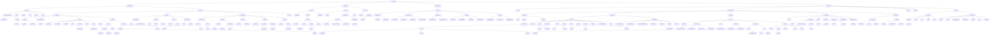

# Project Module Structure

> Cập nhật lúc: 2026-03-20 17:12:19

```mermaid
graph TD
    root_module["module"]
    root_module --> 576393130["infrastructure"]
    576393130 --> 189094717["devops"]
    189094717 --> 1937172859["artifact-management"]
    1937172859 --> 922647045["central-portal"]
    1937172859 --> 699993064["nexus"]
    189094717 --> 1831872207["ci-cd"]
    189094717 --> 989250393["docker"]
    189094717 --> 430959929["git"]
    189094717 --> 1355916957["jenkins"]
    189094717 --> 430962253["k8s"]
    576393130 --> 258728053["system"]
    258728053 --> 1262368510["database"]
    1262368510 --> 1491824552["advance"]
    1491824552 --> 1117455756["function"]
    1491824552 --> 1539742738["package"]
    1491824552 --> 604359860["procedures"]
    1262368510 --> 1286346449["connection-pool"]
    1286346449 --> 551204826["hikariCP"]
    1262368510 --> 831759635["nosql"]
    831759635 --> 1968114431["clickhouse"]
    831759635 --> 1081483700["elasticsearch"]
    831759635 --> 1371449803["influxDB"]
    831759635 --> 2019899574["loki"]
    831759635 --> 1446068567["mongoDB"]
    1446068567 --> 237051439["aggregation"]
    831759635 --> 1809174085["neo4j"]
    831759635 --> 1812859250["redis"]
    1812859250 --> 1348333896["lua-scripting"]
    1262368510 --> 835109564["rdbms"]
    835109564 --> 980901762["mysql"]
    835109564 --> 393427614["oracle"]
    393427614 --> 156206404["advance"]
    156206404 --> 1593398702["package"]
    156206404 --> 649467333["procedure"]
    393427614 --> 398827585["setup"]
    835109564 --> 1626510452["postgresql"]
    1626510452 --> 530229530["advance"]
    530229530 --> 1034338471["functions"]
    530229530 --> 932472054["trigger"]
    1626510452 --> 428376341["setup"]
    258728053 --> 610265657["network"]
    610265657 --> 1459356932["api-gateway"]
    1459356932 --> 810531075["kong"]
    1459356932 --> 219377716["spring-cloud-gateway"]
    610265657 --> 828435725["protocol"]
    828435725 --> 849063415["http"]
    828435725 --> 1774469653["ssl-tls"]
    828435725 --> 1341337594["tcp-udp"]
    610265657 --> 1221724185["proxy"]
    1221724185 --> 1934815314["haproxy"]
    1221724185 --> 488362473["nginx"]
    610265657 --> 1759873542["service-mesh"]
    1759873542 --> 528476466["istio"]
    1759873542 --> 1310989115["linkerd"]
    258728053 --> 1285765766["observability"]
    1285765766 --> 354376987["benchmark"]
    354376987 --> 1575313304["load-test"]
    1575313304 --> 564334115["jmeter"]
    1575313304 --> 948912145["k6"]
    354376987 --> 1557984451["micro"]
    1557984451 --> 136988908["jmh"]
    1285765766 --> 1084678166["dianostic"]
    1084678166 --> 1616002080["profiling"]
    1616002080 --> 447722839["jprofiler"]
    1616002080 --> 1973025640["visual-vm"]
    1084678166 --> 792567535["thread-dump"]
    792567535 --> 656161161["jstack"]
    1285765766 --> 1387763453["logging"]
    1387763453 --> 1930751118["event-log"]
    1387763453 --> 60078474["log-pipeline"]
    1285765766 --> 2001308769["metrics"]
    2001308769 --> 822274073["aggregation"]
    2001308769 --> 2047424124["time-series"]
    2047424124 --> 173610422["prometheus"]
    2001308769 --> 484255511["visualization"]
    484255511 --> 1229910639["grafana"]
    1285765766 --> 21914528["tracing"]
    21914528 --> 1734682900["concept"]
    21914528 --> 469173198["tooling"]
    258728053 --> 539040906["server"]
    root_module --> 1487618047["integration"]
    1487618047 --> 740765716["broker"]
    740765716 --> 1351576050["activeMQ"]
    740765716 --> 588194142["kafka"]
    588194142 --> 1297167817["service"]
    1297167817 --> 115092475["consumer"]
    115092475 --> 199654171["accountant"]
    115092475 --> 1903738068["notification"]
    1297167817 --> 1935923016["control"]
    1297167817 --> 320899177["producer"]
    320899177 --> 1578968929["bank"]
    1297167817 --> 1494881416["server"]
    740765716 --> 1382588922["rabbitMQ"]
    1487618047 --> 1108964100["oneway"]
    1108964100 --> 1860881910["grpc"]
    1108964100 --> 1297755121["httpRequest"]
    1297755121 --> 1175347870["blocking"]
    1175347870 --> 793388897["feign-client"]
    1175347870 --> 1945804697["http-url-connection"]
    1175347870 --> 1228734119["rest-template"]
    1297755121 --> 1714486827["nonBlocking"]
    1714486827 --> 430497589["web-client"]
    1108964100 --> 494149331["sse"]
    1487618047 --> 1260719454["twoway"]
    1260719454 --> 287084057["rsocket"]
    1260719454 --> 1722299081["websocket"]
    root_module --> 1121459940["microservice"]
    1121459940 --> 83823204["module"]
    83823204 --> 1954373418["deployments"]
    1954373418 --> 607230950["docker"]
    1954373418 --> 95721598["grafana"]
    1954373418 --> 1317313616["prometheus"]
    83823204 --> 1359636965["infrastructure"]
    1359636965 --> 620811170["admin-server"]
    1359636965 --> 350773936["api-gateway"]
    1359636965 --> 1464924115["config-server"]
    1359636965 --> 424994399["discovery-server"]
    83823204 --> 793610148["integration"]
    793610148 --> 94400545["message-broker"]
    793610148 --> 1188238509["notification-service"]
    83823204 --> 760328939["platform"]
    760328939 --> 1674997044["common-lib"]
    760328939 --> 223959344["logging-starter"]
    760328939 --> 224998760["resilience4j"]
    760328939 --> 365315027["security-starter"]
    83823204 --> 130003651["service"]
    130003651 --> 175816091["inventory-service"]
    130003651 --> 1035949783["order-service"]
    130003651 --> 1579771215["payment-service"]
    root_module --> 3413350["platform"]
    3413350 --> 1569740737["cloud"]
    3413350 --> 798869563["development"]
    798869563 --> 134249970["build-tool"]
    134249970 --> 157226777["ant"]
    134249970 --> 1691403819["gradle"]
    1691403819 --> 1684131760["open-rewrite"]
    134249970 --> 781777469["maven"]
    798869563 --> 549871961["framework"]
    549871961 --> 912837406["spring"]
    912837406 --> 1969440845["actuator"]
    912837406 --> 372322484["basic"]
    372322484 --> 1098138055["core"]
    1098138055 --> 1235276900["annotation"]
    1098138055 --> 891336539["bean"]
    1098138055 --> 1845975041["scope"]
    372322484 --> 1399200127["profile"]
    372322484 --> 736698021["properties"]
    912837406 --> 1475280524["conditional"]
    912837406 --> 542119324["data"]
    542119324 --> 1465353827["jpa"]
    542119324 --> 540560139["nosql"]
    912837406 --> 1082708429["devtool"]
    912837406 --> 1131501601["import"]
    912837406 --> 1342692527["profile"]
    912837406 --> 625181946["security"]
    625181946 --> 386462004["basic"]
    625181946 --> 500164325["jwt"]
    625181946 --> 374453963["oauth"]
    912837406 --> 159519600["swagger"]
    912837406 --> 1816128324["testPropertySource"]
    912837406 --> 259625306["web"]
    549871961 --> 585571075["spring-boot"]
    585571075 --> 1084932457["auto-configuration"]
    585571075 --> 1959884551["embedded-server"]
    585571075 --> 947090237["externalized-configuration"]
    585571075 --> 293956444["native-image"]
    585571075 --> 1780386660["packaging"]
    585571075 --> 1553074000["starter"]
    1553074000 --> 1217818335["custom-starter"]
    585571075 --> 1078334927["testing"]
    798869563 --> 706358671["language"]
    706358671 --> 645853105["java"]
    645853105 --> 502720011["advance"]
    645853105 --> 2035527802["concurrency"]
    2035527802 --> 779773902["async-programming"]
    2035527802 --> 714200401["executor-service"]
    2035527802 --> 732016877["high-level-utils"]
    2035527802 --> 1099217553["virtual-threads"]
    645853105 --> 927536372["core"]
    927536372 --> 788504546["abstract-interface"]
    645853105 --> 1466403393["mapping"]
    1466403393 --> 1737440032["model-mapper"]
    1466403393 --> 203904460["object-mapper"]
    645853105 --> 510279022["persistence"]
    510279022 --> 988173664["orm"]
    988173664 --> 2080383510["hibernate"]
    988173664 --> 1998686123["jpa-specification"]
    510279022 --> 988169852["sql"]
    988169852 --> 429112915["jdbc"]
    988169852 --> 848989051["mybatis"]
    645853105 --> 980454987["version"]
    980454987 --> 983093875["java11"]
    980454987 --> 983093880["java16"]
    983093880 --> 1573367349["record"]
    980454987 --> 983093881["java17"]
    980454987 --> 2109922692["java7"]
    980454987 --> 2109922693["java8"]
    798869563 --> 803857854["paradigm"]
    803857854 --> 1195799912["aop"]
    803857854 --> 1197147385["concurrency"]
    1197147385 --> 964143465["batch"]
    1197147385 --> 1058383586["forkjoin-workstealing"]
    1197147385 --> 1355351526["schedule"]
    1355351526 --> 800714247["task"]
    1197147385 --> 698055245["thread"]
    803857854 --> 1694880143["di-ioc"]
    803857854 --> 348885027["functional"]
    803857854 --> 1484599811["mvc-pattern"]
    1484599811 --> 655155435["controller"]
    1484599811 --> 2144061424["model"]
    1484599811 --> 1898472924["service"]
    803857854 --> 518856488["object-oriented"]
    803857854 --> 1898490054["reactive-stream"]
    1898490054 --> 1056022683["webflux"]
    798869563 --> 338768112["validation"]
    338768112 --> 363215036["performance"]
    363215036 --> 721147291["benchmark"]
    363215036 --> 821629705["jmeter"]
    363215036 --> 45880703["load-test"]
    338768112 --> 676107044["testing"]
    676107044 --> 1005370719["e2e-test"]
    676107044 --> 1638127267["integration-test"]
    676107044 --> 664239235["unit-test"]
    3413350 --> 193438302["digital"]
    3413350 --> 956854621["social"]
    3413350 --> 586280793["support"]
    586280793 --> 1773667778["document"]
    1773667778 --> 741315275["diagram"]
    741315275 --> 1728362210["mermaid"]
    1773667778 --> 848560231["excel"]
    1773667778 --> 514838956["pdf"]
    1773667778 --> 1220081128["word"]
    1773667778 --> 514830983["xml"]
    586280793 --> 1553361038["notification"]
    1553361038 --> 1768068402["email"]
    1553361038 --> 1762875403["kakao"]
    1553361038 --> 2065862422["microsoft-team"]
    1553361038 --> 632211223["mobile-push"]
    1553361038 --> 1755169086["slack"]
    1553361038 --> 484507381["sms"]
    1553361038 --> 1168366449["telegram"]
```
